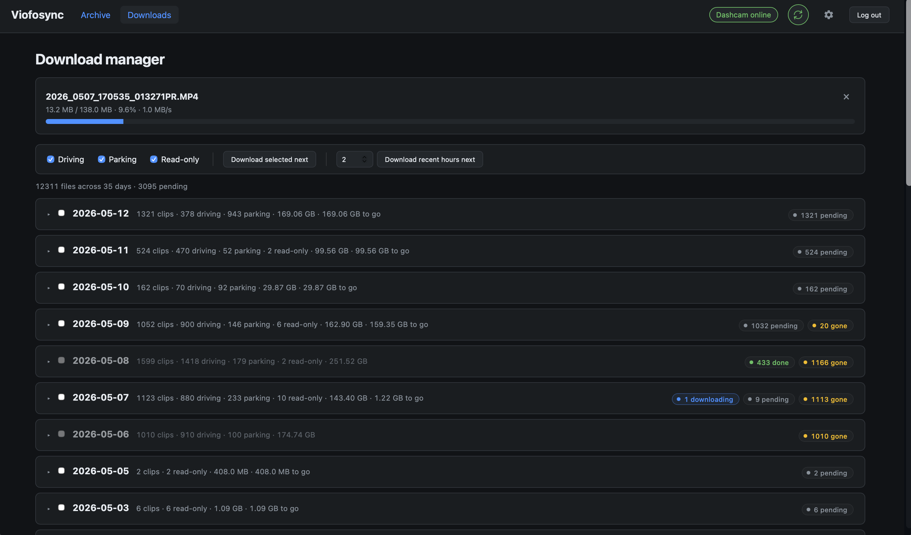

# viofosync

Self-hosted web app for syncing, browsing, and exporting recordings from a Viofo dashcam (tested with the A229 Pro) over Wi-Fi. Runs as a single Docker container on a NAS or any always-on host on the same network as the dashcam.

> **v2 is a full rewrite.** v1 was a cron-driven CLI based on [BlackVueSync](https://github.com/acolomba/BlackVueSync). v2 uses the same dashcam protocol but ships a web UI, journey-detected GPS maps, ffmpeg exports, JSON-backed settings, a first-run setup wizard, and a UI-driven download manager. The v1 cron CLI is preserved on the `main` branch.



## Features

- **Archive browser** — clips grouped by day, paired front/rear, in-browser playback.
- **GPS journeys** — clickable map per trip with auto-split stops and reverse-geocoded place names.
- **Exports** — original clips, joined front/rear or picture-in-picture videos via ffmpeg.
- **Download manager** — live progress with session speed and ETA, a reorderable queue.
- **Auto-delete from dashcam** *(optional)* — frees SD card space once a clip is safely downloaded.
- **Settings page** — runtime settings hot-reload; no Docker env vars to fiddle with.
- **Home Assistant support** — auto-discovered sensors and buttons via MQTT.

## Hardware

The dashcam must stay powered on and connected to Wi-Fi. A hardwire kit (e.g. Viofo HK4) plus a dedicated dashcam battery is recommended.

It should join your LAN in Wi-Fi **station** mode. As of May 2026 the official A229 Pro firmware does not retain Wi-Fi state across reboots but Viofo support will provide a custom firmware on request.

Reserve the dashcam's IP on your router so it doesn't change.

## Quick start

```bash
docker run -d \
  --name viofosync \
  -p 8080:8080 \
  -e PUID=$(id -u) \
  -e PGID=$(id -g) \
  -e TZ=Europe/London \
  -v /path/to/config:/config \
  -v /path/to/recordings:/recordings \
  --restart unless-stopped \
  robxyz/viofosync
```

Open `http://<host>:8080` and the first boot redirects you to a one-screen setup wizard at `/setup`. Enter the dashcam IP and an admin password (12+ characters) to finish. The wizard writes `/config/config.json` with a freshly-generated `SESSION_SECRET` and a bcrypt hash of the password — neither is held in env vars or the image.

After setup, every other setting lives on the **Settings** page in the UI.

> ⚠ **Setup window safety.** Until the wizard is submitted there is no auth on the container — the wizard self-disables after first submission and the route returns 404 thereafter. Don't expose the container to the public internet during this window.

## Configuration

The only Docker-level env vars are:

| Variable        | Description                                      | Default      |
| --------------- | ------------------------------------------------ | ------------ |
| `PUID` / `PGID` | Owner of `/config` and `/recordings` on the host | host UID/GID |
| `TZ`            | Timezone for log timestamps                      | UTC          |

App-level settings (sync interval, dashcam IP, encoder, geocoding email, web port, retention, password, auto-delete, etc.) are editable on the **Settings** page. Advanced users can hand-edit `/config/config.json` between restarts; the schema lives in `[web/settings_schema.py](web/settings_schema.py)`.

### Importing without Wi-Fi

Use **Import manually** in the web UI to ingest clips you already have on disk. Two modes:

- **Upload** — pick a folder in your browser; clips upload one at a time and slot straight into the archive. On a quota-bound archive it makes room as it goes, evicting the oldest clips (never anything newer than what you're importing).
- **Folder** — copy clips into the `import` folder inside your recordings share, then **Scan** → **Ingest**. By default this is `recordings/import`; for a one-off import from a different path, type it in the Import dialog's Folder tab, or set a persistent default via the advanced `IMPORT_PATH` key in `/config/config.json`.

**From a USB drive / card reader:** bind-mount it into the container and set the import path to the mount, e.g.:

```bash
docker run ... -v /mnt/usb:/import robxyz/viofosync
# then type /import in the Import dialog, or set IMPORT_PATH=/import in /config/config.json
```

The source is only ever **read** — originals on the card/USB are never deleted. If you plug the drive in *after* the container starts, either restart the container or use shared mount propagation (`-v /mnt:/mnt:rshared`, with the host mount also shared) so the container sees it.

Imported clips are recognised by Viofo naming (`YYYY_MMDD_HHMMSS_NNNN[event][cam].MP4`); locked clips under an `RO/` folder keep their protected status. Non-matching files are left untouched.

## Alternative camera address

You can set an optional **Alternative address** (Settings → Dashcam) — a second IP/host for the **same** dashcam. It is **not** for a second camera.

This is for reaching one camera at more than one address depending on where the car is, for example:

- A Raspberry Pi running a VPN hotspot, so you can reach the dashcam remotely when the car is away from home.
- A site-to-site VPN to a second location the car is regularly parked at, where the camera sits on a different subnet/IP.

The alternative uses the same form as the primary (IP or hostname, plain `http`, port 80).

## Home Assistant via MQTT

viofosync can publish state and accept actions over MQTT, with full Home Assistant auto-discovery.

Enable on the Settings page → MQTT. You'll need:

- A reachable MQTT broker (Mosquitto, HA's built-in broker, EMQX, etc.).
- Broker host + port. Optional username, password, and TLS.
- A `Node ID` (default `viofosync`) — used as the topic prefix and as the `node_id` slot in HA discovery topics. Letters, digits, and `_` only. Set a distinct value per instance if you run more than one.

When MQTT is on, viofosync publishes:

- **Discovery configs** under `homeassistant/{component}/{node_id}/{object_id}/config` (retained) so HA picks them up immediately.
- **State** under `{node_id}/{object_id}/state` (retained, event-driven, no idle traffic).
- **Availability** to `{node_id}/availability` (`online` / `offline`), with LWT so HA marks every entity Unavailable within ~45s of an unclean disconnect.

### Sensors and buttons

Enabled by default in HA: dashcam connectivity, dashcam connection (`primary` / `alternative` / `offline`, with the live address as an `address` attribute), sync status (`downloading` / `waiting` / `paused` / `error`), queue pending, last downloaded clip, disk used, and six action buttons (start/pause/skip/refresh/retry-failed/rescan).

Disabled-by-default (still created — enable per-entity in HA): queue failed, queue downloading, current filename, current progress, total clips.

### Parameterised command

For "prioritize the last N hours", publish to `{node_id}/cmd/prioritize_recent` with payload `{"hours": 0.5}` (HA's `mqtt.publish` service works). `hours` must be in (0, 168].

### Security notes

- The MQTT password is stored in `config.json` in plaintext, alongside the bcrypt hash of the admin password and the session secret. The same access controls already apply to that file.

## Reverse geocoding

Journey and stop cards display their start/end as *"Street, Town"* via Nominatim (OpenStreetMap). Lookups are rate-limited to 1/second per [Nominatim's usage policy](https://operations.osmfoundation.org/policies/nominatim/) and cached in the `geocode_cache` table (coords rounded to 3 d.p., ≈110 m). Set **Nominatim email** in Settings → GPS & Geocoding to identify your install per OSM's terms; toggle the **GPS maps** filter off on the Archive page to skip the Leaflet + Nominatim machinery entirely for low-bandwidth browsing.

## XML vs HTML listing

By default the app scrapes the dashcam's HTML directory listings (`/DCIM/Movie`, `/DCIM/Movie/Parking`, `/DCIM/Movie/RO`), which is noticeably faster on some firmware than the XML API (`/?custom=1&cmd=3015&par=1`). Toggle off **Use HTML directory listing** in Settings → Dashcam to fall back to XML.

## Migrating from v1

Existing installs with a `viofosync.env` file are migrated automatically on first boot of the v2 image:

- Settings land in `/config/config.json`.
- The original `viofosync.env` is preserved with a deprecation header — safe to delete.
- The cron-style entry point is no longer the primary path; the web app's sync worker covers the same ground with live progress and queue control.

`PUID` / `PGID` / `TZ` env vars work the same as v1.

## Running without Docker

For development or for hosts that don't have Docker:

```bash
pip install -r requirements.txt
CONFIG_DIR=/path/to/config RECORDINGS=/path/to/archive \
  python3 -m web.launcher
```

`web.launcher` reads `WEB_HOST` / `WEB_PORT` from `config.json` (defaults `0.0.0.0:8080`) and re-execs into uvicorn. On first run, browse to `http://localhost:8080/setup`. `ffmpeg` must be on `$PATH` for thumbnails and exports.

## AI Code

This opensource project uses AI generated code and is intended for personal home use. It is not recommended that the server is exposed to the public internet.

## Credits

The GPX extraction logic uses the method described at [https://sergei.nz/extracting-gps-data-from-viofo-a119-and-other-novatek-powered-cameras/](https://sergei.nz/extracting-gps-data-from-viofo-a119-and-other-novatek-powered-cameras/).

This software is unaffiliated with Viofo or any other vendor.

## License

MIT — see [LICENSE](LICENSE).
